# Agent avatars

Every Core agent has an avatar in `assets/avatars/<agent id>.png` (512 × 512 PNG), ready to upload as its Agent bot's **App Icon** (Developer Portal → General Information). The Router speaks through the Manager bot, so `router.png` is only needed if you give the Router a bot of its own.

| | Agent | Prop |
|---|---|---|
| 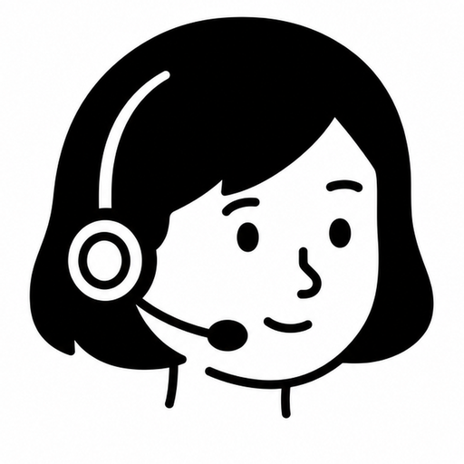 | Manager | headset with a mic |
| 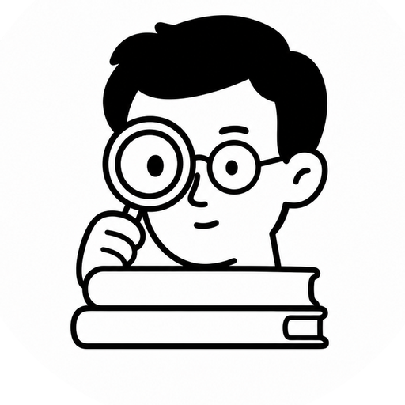 | KB Researcher | magnifying glass over books |
| 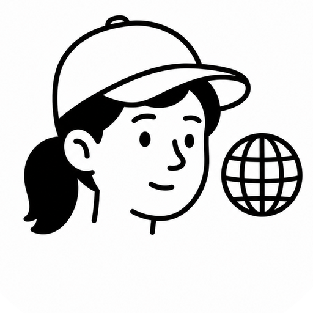 | Web Researcher | globe |
| 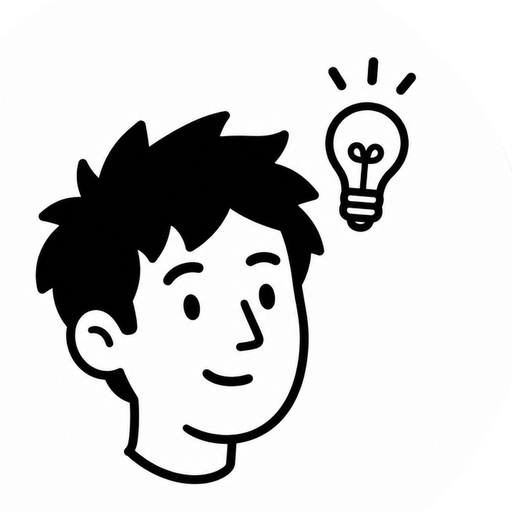 | Brainstormer | light bulb |
| 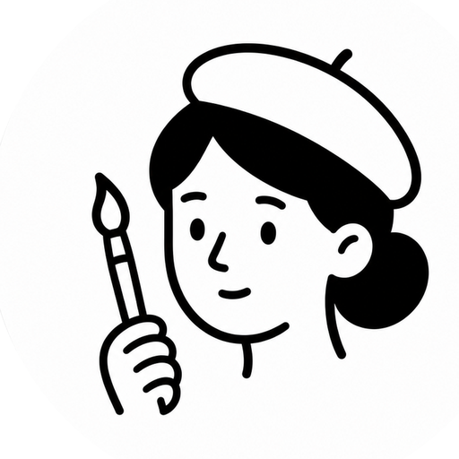 | Artist | beret and paintbrush |
| 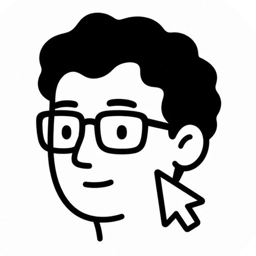 | UX Expert | mouse pointer |
| 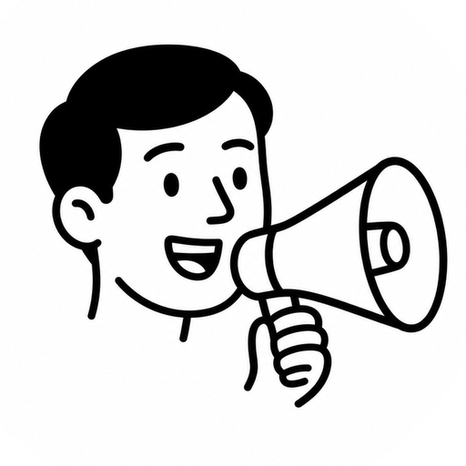 | Marketing | megaphone |
| 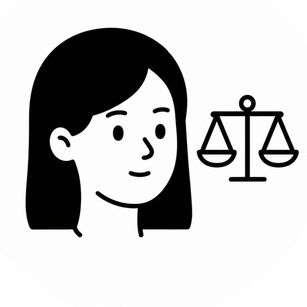 | Lawyer | scales of justice |
| 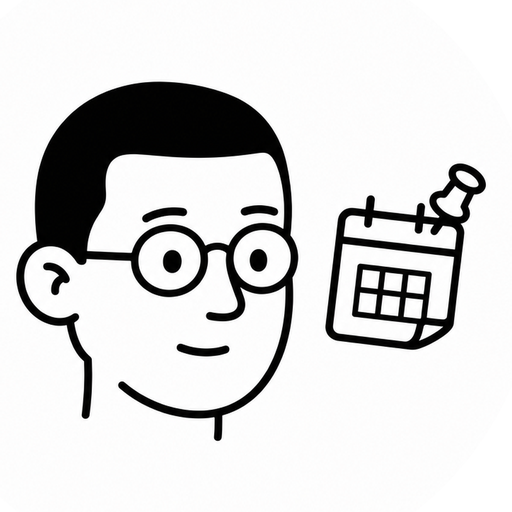 | Planner | calendar page with a pin |
| 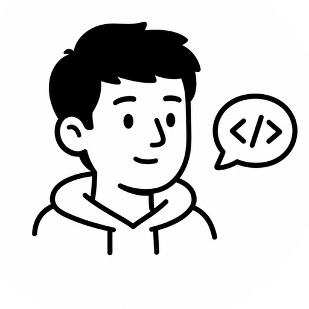 | Coder | `</>` speech bubble |
| 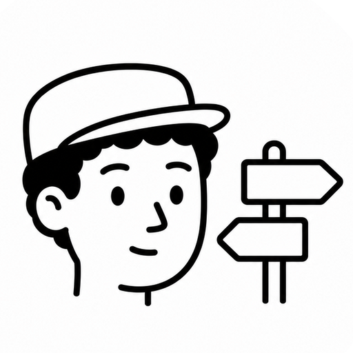 | Router | signpost with two arrows |

## Look

- The head and neck of an invented character in the flat line style of Notion's illustrations: thick uniform black outline, dot eyes, minimal nose and mouth, hair as a flat black fill, white skin. Mixed genders and hair; never a real person's likeness.
- Black and white only: no color, shading, text, letters or logo.
- The role is told by **one** bold prop in the same line weight, readable at 64 px. Hair, headwear and glasses vary the faces; the prop tells the role.
- Final file: a tight crop of the ink (head + prop) on pure white, filling the square. Discord shows avatars as a circle, so the ink stays inside the inscribed circle.

## Making a new one

Use this for a Custom agent, or to redo a Core avatar that breaks the style. A Custom agent's avatar goes straight to its bot's App Icon; keep its file with the KB's own design files, not in this repo.

### Generate

- OpenAI `gpt-image-2`, `images.edit`, `size=1024x1024`, `quality=medium` (about USD 0.05 per image in October 2026; `high` costs about four times more and is only worth it for finals). The key comes from your environment; never paste it anywhere.
- Input image: a style reference, a grid of small head-only characters in the target style. It is not included here, since it would be third-party artwork; use one you have the right to use.
- Always pass that original reference, never a previous output: chaining outputs drifts the style.
- `gpt-image-2` accepts neither `background=transparent` nor `input_fidelity`, so the prompt asks for a white disc on a flat gray square, and the crop below removes it.

Prompt = the base prompt, a blank line, then `This character: <line>`.

```
The attached image is a style reference only: a grid of small head-only characters drawn in the Notion illustration style. Draw ONE new, different character in exactly that style: a single head and a hint of neck, centered, facing slightly to the side or front. Thick uniform black outline, simple dot eyes, minimal nose and mouth, hair as a flat solid black fill, white skin, no shading, no gradients, no color anywhere (pure black and white only). Place the head inside one large pure white circle on a flat pale gray (#EDEDED) square background; the circle fills about 80% of the canvas width and the face is centered with generous margin so a circular crop keeps everything. Exactly one character, do not reproduce the grid, no text, no letters, no logo. The role is told only by ONE bold, simple prop that stays readable at 64 px, drawn in the same thick black line.
```

Line template: `<who: gender, hair, headwear, glasses>, <ONE prop, where it sits, how it is held>.` When the prop floats beside the head, add "head large and centered", otherwise the model shrinks the head.

| Agent | Line |
|---|---|
| manager | a woman with a short bob of black hair wearing a headset with a small mic, one earpiece clearly visible. |
| kb-researcher | a man with round glasses and short black hair, holding a small magnifying glass in front of one eye over a stack of two books at the bottom edge. |
| web-researcher | a person with a ponytail wearing a baseball cap, a small globe with grid lines floating at the side of the head. |
| brainstormer | a man with messy spiky black hair, head large and centered in the circle (face as big as the other characters), a light bulb with three short spark lines floating just above and beside the head, inside the circle. |
| artist | a woman with a bun, wearing a beret, holding a paintbrush upright near her face. |
| ux-expert | a person with thick-rimmed rectangular glasses and wavy hair, a big mouse pointer arrow cursor near the cheek. |
| marketing | a smiling man with a side-parted hair, an open mouth, holding a big megaphone near the mouth pointing outward. |
| lawyer | a woman with long straight black hair, a small set of justice scales (balance) floating beside the head. |
| planner | a man with a buzz cut and small glasses, a small calendar page with a push pin floating at the side. |
| coder | a person with short black hair and a hooded sweatshirt (hood down around the neck), head large and centered, a '</>' symbol in a small speech bubble floating beside the head. Same thick black outline weight as the others. |
| router | a person with short curly black hair wearing a flat-top cap, a signpost with two arrows pointing opposite directions next to the head. |

A Custom agent line, for example a finance agent: `a woman with a short curly afro and small round earrings, a big coin with a dollar sign floating beside the head and a tiny piggy bank held at the bottom edge.`

### Crop

The model varies the gray background and the disc size from one image to the next, so every output goes through the same crop instead of being regenerated:

1. Find the white disc (pixels ≥ 250) and ignore everything outside it.
2. Take the ink inside the disc (pixels < 140): the head and the prop.
3. Compute the ink's smallest enclosing circle, center it, and scale the image so that circle fills 94% of the square's inscribed circle.
4. Paste the inside of the disc on pure white and resize to 512 × 512.

Heads end up about the same size; the prop decides the exact zoom.

### Check

- Look at it masked to a circle at 64 px and 32 px, next to the other avatars.
- If the prop is not recognizable at 32 px, one accent color on the prop only is allowed; nothing else gets color.
- Regenerate only the avatars that break the style, and get the owner's verdict on the whole set side by side before replacing one.
