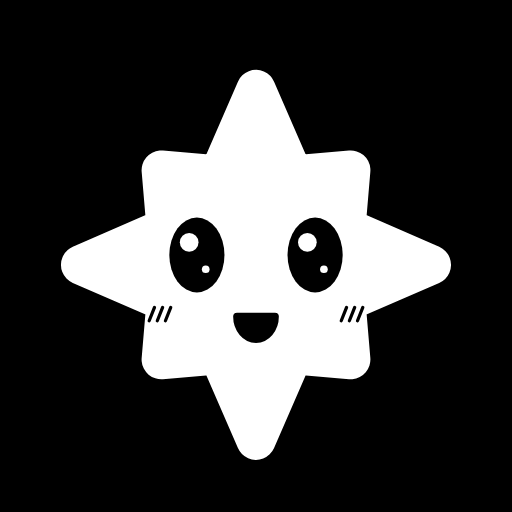

# Logo and agent avatars

**CrelioBot's logo** is the spark: `assets/logo/creliobot.svg`, with `creliobot-512.png` and `creliobot-32.png`. Use it as the Discord server icon (Server Settings → Overview) if you like.

## Agent avatars

Every Core agent, and the Router, has an avatar in `assets/avatars/<agent id>.png` (512 × 512), with its source in `assets/avatars/svg/<agent id>.svg`. They are the spark's family: the same little face in white, on the agent's own color, with one prop that tells its role.

| | Agent | Prop | Color |
|---|---|---|---|
|  | Manager | headset | `#2563EB` |
|  | KB Researcher | book and magnifying glass | `#8B5E3C` |
|  | Web Researcher | globe | `#0E7490` |
|  | Brainstormer | light bulb | `#CA8A04` |
|  | Artist | beret and brush | `#C026D3` |
|  | UX Expert | window and pointer | `#6D28D9` |
|  | Marketing | megaphone | `#B91C1C` |
|  | Lawyer | scales | `#475569` |
|  | Planner | calendar | `#EA580C` |
|  | Coder | `< >` | `#16A34A` |
|  | Router | signposts | `#0F766E` |

**They are applied for you**: registering a bot (`crelio bot add <agent>`, or `bot_register` from Discord) gives it its avatar when it has none. For bots registered before, run `node bin/crelio.mjs bot avatars` (`--force` replaces avatars already set). The Router speaks through the Manager bot, so `router.png` only matters if the Router gets a bot of its own.

## A Custom agent's avatar

Put a 512 × 512 PNG in `workspace/avatars/<agent id>.png` — the Workspace's file wins over the repo's, so this also works to give a Core agent another look. To match the family, copy an SVG from `assets/avatars/svg/`, change the background color (the first `<rect>`) and the prop, and export it at 512 px. Then register the bot, or run `crelio bot avatars`.

Discord shows avatars as a circle: keep the prop inside the inscribed circle.
